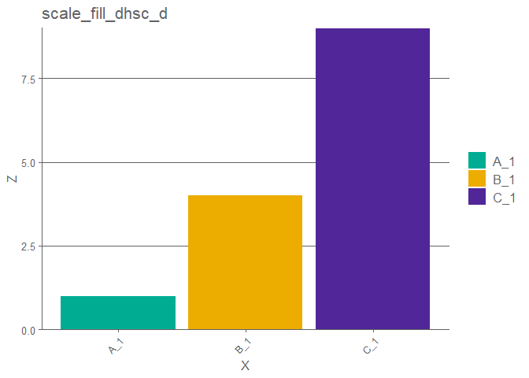
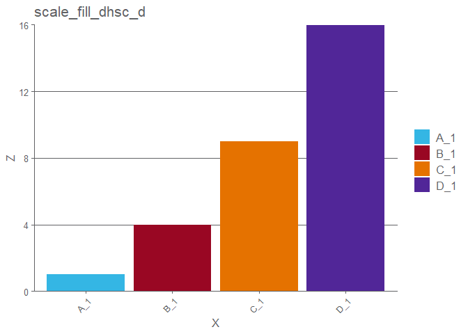
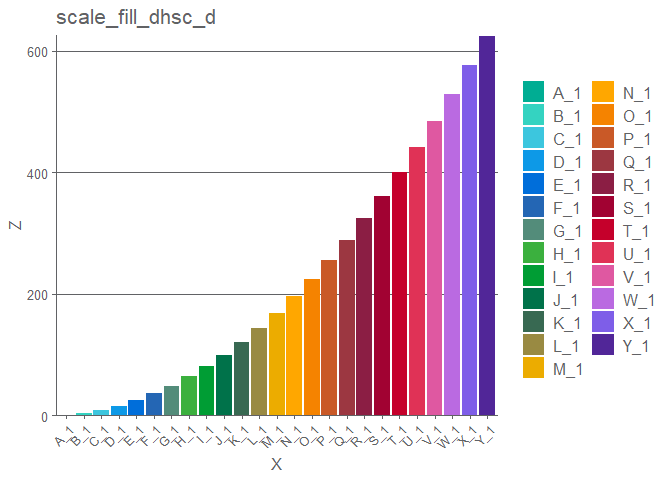
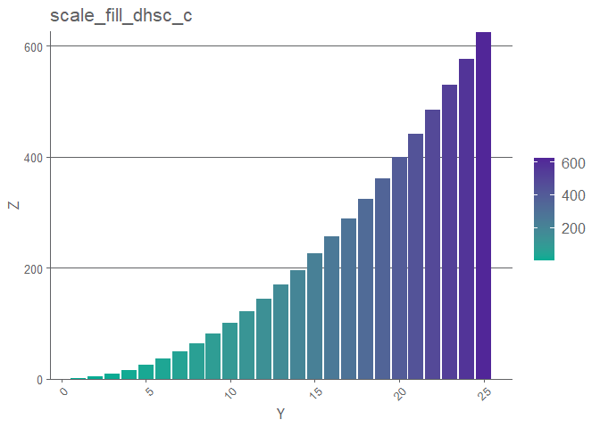
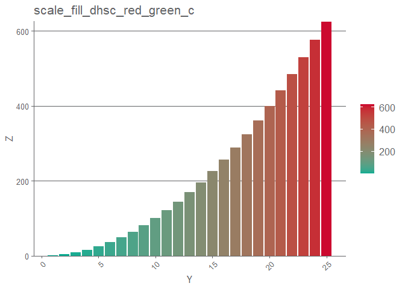
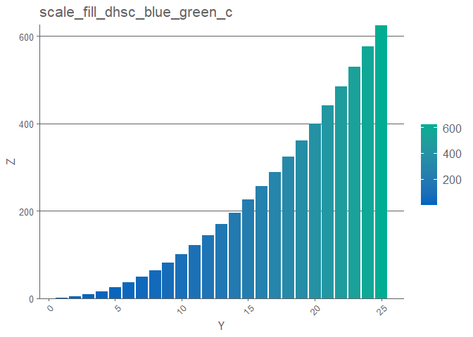
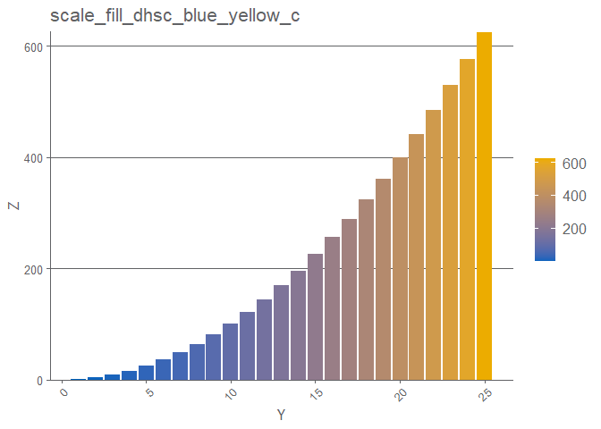

<!-- README.md is generated from README.Rmd. Please edit that file -->

# DHSC Colours R package

## 🚨 Deprecation Notice 🚨

This repository is **deprecated** as of 17 October 2024. It is no longer
actively maintained. For similar functionality, please refer to
[afcolours](https://github.com/best-practice-and-impact/afcolours).

## Features

- DHSC branded powerpoint template for rmarkdown.
- Approved colour codes for DHSC outputs.
- Colourblind friendly options
- ggplot theme for consistant outputs
- ggplot fill and colour scales using dhsc branding colours.
- Shortcut function remove y axis padding so intercept can be 0.
- DHSC_table function for left aligned tables in markdown.

## Installation

Install using remotes:

``` r
remotes::install_github("https://github.com/DataS-DHSC/DHSC_colours")
```

## Branded powerpoint template

Installing this package will install the template for a DHSC branded
powerpoint in rmarkdown. Accessed from within rstudio via: *File \> New
File \> R Markdown \> From Template \> DHSC Powerpoint*

## Colour Codes

The function `dhsc_colours()` will return a named list of the approved
colours. Each individual colour can also be called by it’s helper
function. For example: `dhsc_dark_blue()`. There are approved shades of
black, white and grey, which are retrieved via `dhsc_bw()`

Having access to the individual colour codes like this will allow users
to quickly format whatever vizualisation library they are using to align
with the DHSC palette.

## Colourblind friendly palettes

Three and four colour accesible pallets have been hard coded into this
package. You can retrieve the colour selections with
`DHSC_accessible_3()` and `DHSC_accessible_4()`. Or you can use them
directly with your ggplots via

``` dhsc_accessible_scales()```.

## ggplot theme

There is a ggplot theme which you can include with any ggplot to standardise on a 
consistant aesthetic. The theme is accessed via ```theme_dhsc()``` and can be
included in any ggplot with ```+theme_dhsc()```

## ggplot colour and fill scales

There are also some colour scales which you can ```+``` on to a ggplot object 
to recolour it with DHSC colours. There are separate scales for continuous and discrete variables.

## Shortcut to set y axis intercept to 0. 

By default, ggplot adds a 5% padding to your data when creating a y axis, this is
to ensure that your data don't sit directly on the axis line. However it is not
always desirable, e.g. with bar plots. Adding ```+zero_y_padding()``` to your
ggplot objects will remove the padding, improving the way some plots appear. 

## DHSC tables

By default, numeric columns in rmarkdown can appear right aligned (excel style).
The ```DHSC_table()``` function removes this behaviour and aligns all table text
to the left.

## Example Plots


```r
library(dplyr)
#> Warning: package 'dplyr' was built under R version 4.2.3
library(ggplot2)
#> Warning: package 'ggplot2' was built under R version 4.2.3
library(DHSCcolours)

# Barplot with 3 bars with a discrete X axis filled with DHSC colours
sim_series(3) %>%
  ggplot(aes(x = X, y = Z, fill = X)) +
  geom_col() +
  DHSCcolours::scale_fill_dhsc_d() +
  theme_dhsc() +
  ggtitle("scale_fill_dhsc_d") +
  zero_y_padding()
```

<!-- -->

``` r

# Barplot with 4 bars with a discrete X axis filled with accesible colours
sim_series(4) %>%
  ggplot(aes(x = X, y = Z, fill = X)) +
  geom_col() +
  DHSCcolours::DHSC_accessible_scales(4) +
  theme_dhsc() +
  ggtitle("scale_fill_dhsc_d") +
  zero_y_padding()
```

<!-- -->

``` r

# Barplot with 25 bars with a discrete X axis filled with DHSC colours
sim_series(25) %>%
  ggplot(aes(x = X, y = Z, fill = X)) +
  geom_col() +
  DHSCcolours::scale_fill_dhsc_d() +
  theme_dhsc() +
  ggtitle("scale_fill_dhsc_d") +
  zero_y_padding()
```

<!-- -->

``` r

# Barplot with 25 bars with a continuous X axis with DHSC primary green - purple fill
sim_series(25) %>%
  ggplot(aes(x = Y, y = Z, fill = Z)) +
  geom_col() +
  scale_fill_dhsc_c() +
  theme_dhsc() +
  ggtitle("scale_fill_dhsc_c") +
  zero_y_padding()
```

<!-- -->

``` r

# Barplot with 25 bars with a continuous X axis with red green fill
sim_series(25) %>%
  ggplot(aes(x = Y, y = Z, fill = Z)) +
  geom_col() +
  scale_fill_dhsc_red_green_c() +
  theme_dhsc() +
  ggtitle("scale_fill_dhsc_red_green_c") +
  zero_y_padding()
```

<!-- -->

``` r

# Barplot with 25 bars with a continuous X axis with blue green fill
sim_series(25) %>%
  ggplot(aes(x = Y, y = Z, fill = Z)) +
  geom_col() +
  scale_fill_dhsc_blue_green_c() +
  theme_dhsc() +
  ggtitle("scale_fill_dhsc_blue_green_c") +
  zero_y_padding()
```

<!-- -->

``` r

# Barplot with 25 bars with a continuous X axis with blue yellow fill
sim_series(25) %>%
  ggplot(aes(x = Y, y = Z, fill = Z)) +
  geom_col() +
  scale_fill_dhsc_blue_yellow_c() +
  theme_dhsc() +
  ggtitle("scale_fill_dhsc_blue_yellow_c") +
  zero_y_padding()
```

<!-- -->
